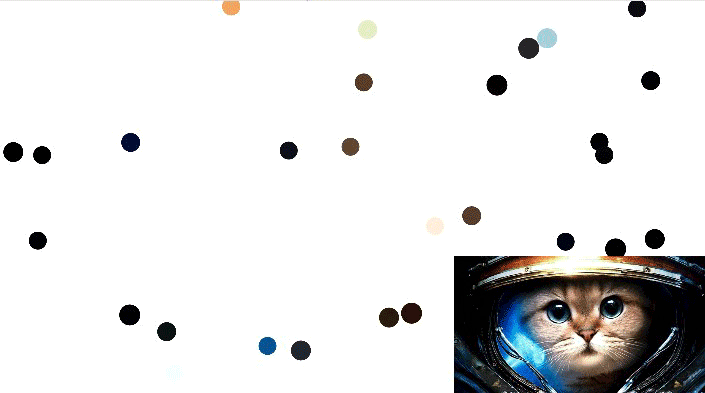

# Welcome to my GitHub page :]
<br/>

## Animated-Circle-Packing<br/>

>[HTML Link](https://hgleocho.github.io/Animated-Circle-Packing)

>Changed the stroke on each circle, to become a variable - which I then decrement its value to get different color circle per instantiation.
>stroke to have a random green hue as well.
>
>Things to add.
>+ add buttons and Range slider for configuration.
>+ Start button.
>
>

<br/><br/><br/>


## TerrainOverview simulator<br/>
>[HTML Link](https://hgleocho.github.io/TerrainOverview/)


>although it might look like you are flying over the field, you are in fact standing still.
its only the y-cord that is moving back and forth creating such an illusion.
>[Source wiki](http://flafla2.github.io/2014/08/09/perlinnoise.html)

<br/><br/>


## Web-Dev-Practice<br/>

>[Web-Dev-Practice v1](https://hgleocho.github.io/Web-Dev-Practice/)<br/>
>- jQuery, MongoDB, Bootstrap, Knockout<br/>
> Database website using heroku as back server<br/>

>[Web-Dev-Practice v2](https://hgleocho.github.io/Web-Dev-Practice-v2/)<br/>
>- React<br/>
>- Bootstrap, moment, axios<br/>
> Database website mainly using React with heroku as back server<br/>
<br/><br/><br/>

## WaterRipples<br/>

>[HTML Link](https://hgleocho.github.io/WaterRipples)<br/>
```
WaterRipples using p5.js
```
<br/><br/><br/>

## Recursion<br/>
>[HTML Link](https://hgleocho.github.io/Recursion)<br/>

```
* Alca - 
[Demo](https://codepen.io/Alca/full/pWaZaX/) 
| [Source](https://codepen.io/Alca/pen/pWaZaX/right)

* Justin Riley Recursive Remix - 
[Demo](https://recursion.glitch.me/) 
| [Source](https://glitch.com/edit/#!/recursion)

* Recursive Squares - 
[Demo](https://codepen.io/DonKarlssonSan/full/PJQvKG) 
| [Source](https://codepen.io/DonKarlssonSan/pen/PJQvKG)

* Recursive Koch Curve - 
[Demo](https://codepen.io/DonKarlssonSan/full/yzjywa) 
| [Source](https://codepen.io/DonKarlssonSan/pen/yzjywa)
```

<br/><br/><br/>


## SnakeGame

[Github Link](https://github.com/HGLeoCho/SnakeGame)

```
SnakeGame using various languages
c++
```

<br/><br/><br/>
[Page Source](./another-page.html).

